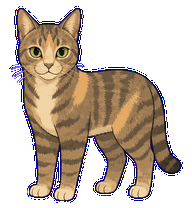

# Marble Codex Pet

Install Marble, a Codex v2 animated desktop pet, directly from GitHub. This package
has no runtime dependencies and does not need to be published to the npm
registry.



## Requirements

- A Codex app build that supports custom Pets.
- Node.js 22 or newer, including `npm`/`npx`.

## Install

Install the reviewed `v1.0.0` release:

```sh
npx --yes github:leeedwina430/marble-codex-pet#v1.0.0 add marble
```

To intentionally follow the latest default branch instead:

```sh
npx --yes github:leeedwina430/marble-codex-pet add marble
```

Then open Codex Settings > Pets and refresh the pet list.

The installer writes to `$CODEX_HOME/pets/marble`. If `CODEX_HOME` is not set, it
uses `~/.codex/pets/marble`.

## Commands

```sh
# Show bundled pets
npx --yes github:leeedwina430/marble-codex-pet list

# Install Marble
npx --yes github:leeedwina430/marble-codex-pet add marble

# Back up a changed local Marble directory and reinstall
npx --yes github:leeedwina430/marble-codex-pet add marble --force
```

An identical existing installation is left unchanged. A different existing
installation is never overwritten unless `--force` is explicitly supplied.
With `--force`, the old directory is retained beside the new one as a
timestamped backup. Installation is staged under the destination filesystem,
validated, and renamed atomically; a failed replacement attempts to restore the
backup.

## Verify before release

Use Node.js 22 or newer:

```sh
npm test
npm run pack:check
```

Test an installation without touching your normal Codex configuration:

```sh
marble_test_home="$(mktemp -d)"
env CODEX_HOME="$marble_test_home" node ./bin/codex-pets.js add marble
```

## Repository layout

- `marble/` contains the install-ready Codex v2 pet package.
- `bin/` contains the single executable selected by `npx`.
- `src/` contains the catalog, CLI, integrity checks, and atomic installer.
- `test/` covers CLI behavior, safe replacement, rollback, and idempotence.

## Pet package contract

Marble uses Codex pet sprite contract v2: a transparent RGBA WebP atlas measuring
1536×2288, arranged as 8 columns × 11 rows of 192×208 cells. It contains the
nine standard animation rows and all 16 clockwise look directions.

## Security

The installer has zero runtime dependencies, no telemetry, no lifecycle
scripts, and makes no network requests after `npx` fetches this repository. It
verifies the bundled WebP against its published SHA-256, validates the v2
manifest, stages the copy on the destination filesystem, and installs it with
an atomic rename.

## Licenses and privacy

Installer code is available under the MIT terms stated in [LICENSE](LICENSE).
Marble's manifest, spritesheet, previews, and character artwork are governed
separately by [ASSET_LICENSE.md](ASSET_LICENSE.md).

Do not add source photographs, generation prompts containing private
information, or internal QA artifacts to this public repository.
